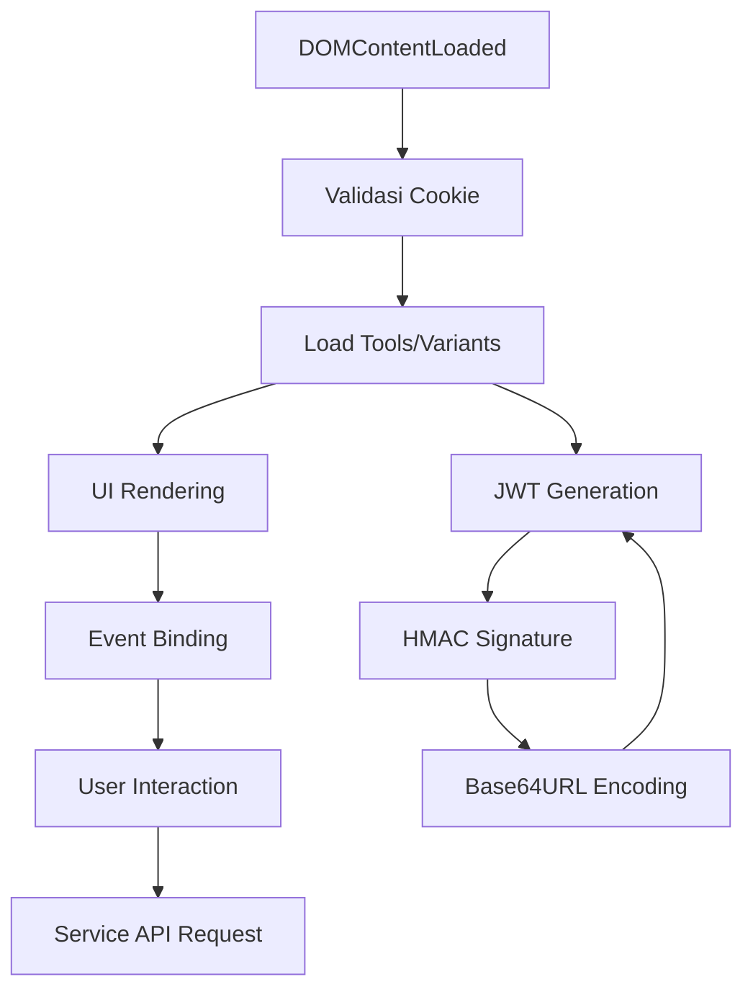

# Analisis Ekstensi "Toolify" v2.3.1

## 🔍 Overview

"Toolify Extension" ini menyamar sebagai ekstensi browser yang menawarkan akses ke berbagai layanan premium (Netflix, ChatGPT, dll) secara gratis. Namun, di balik layar, ekstensi ini sebenarnya merupakan malware yang melakukan:

- 📊 Pengumpulan data browsing yang ekstensif 
- 🔑 Pencurian kredensial login
- 💳 Ekstraksi informasi sensitif (kartu kredit, email, password)
- 📡 Komunikasi dengan server Command & Control
- 🛡️ Penghindaran deteksi dari software keamanan

## 🔄 Flow Eksekusi Aplikasi

## 🧩 Komponen Utama

### 🔐 Background Service (`background.js`)
Background service ini menjalankan beberapa fungsi berbahaya seperti:
- `blockTrafficAndURLs()` - Memblokir akses ke situs keamanan
- `setupTrackingListeners()` - Menyiapkan listener untuk mengumpulkan data
- `collectAndSendBrowsingData()` - Mengumpulkan dan mengirim data browsing ke server
- `extractDOMData()` - Mengekstrak data sensitif dari DOM
- `processSensitiveData()` - Memproses data sensitif sebelum dikirim
- `sendDataToServer()` - Mengirim data ke server C&C

### 🔧 Content Script (`modification.js`)
Script ini memodifikasi DOM website yang dikunjungi untuk:
- Bypass premium features (Netflix, ChatGPT, dll)
- Menyembunyikan elemen subscription/paywall
- Mengirim data pengguna ke server eksternal

### 📱 Popup UI (`toolify.js`)
User interface ekstensi yang:
- Melakukan validasi status subscription
- Mengelola cookie cross-domain
- Mengimplementasi autentikasi berbasis JWT dengan HMAC signature
- Menampilkan UI dinamis berdasarkan status pengguna

## 🌐 Detail Flowchart Teknis

### Flowchart 1: Proses Autentikasi & JWT

Flowchart ini menjelaskan:
- Proses validasi cookie untuk autentikasi
- Pembuatan token JWT untuk request ke API
- Penggunaan HMAC signature untuk mengamankan komunikasi
- Enkripsi Base64URL untuk data yang dikirim

### Flowchart 2: Ekstraksi & Transmisi Data

Flowchart ini menunjukkan:
- Metode pengumpulan data user (history, cookies, form input)
- Proses ekstraksi informasi sensitif dari halaman web
- Obfuskasi data sebelum pengiriman
- Komunikasi dengan server Command & Control

### Flowchart 3: Bypass Premium Services

Flowchart ini menggambarkan:
- Teknik manipulasi DOM untuk bypass paywall
- Modifikasi elemen UI pada layanan premium
- Metode pengelabuan sistem deteksi langganan
- Injeksi script untuk memodifikasi perilaku website

## 🛠️ Teknik Yang Digunakan

### 1. Teknik Persisten
- Event listeners pada `onInstalled`, `onUpdated`, dan `onActivated`
- Penggunaan chrome storage untuk menyimpan data
- Komunikasi background-content yang berkelanjutan

### 2. Teknik Anti-Deteksi
- Obfuskasi kode JavaScript
- Pemblokiran akses ke website keamanan
- Pengecekan untuk ekstensi keamanan lainnya
- Mekanisme fallback jika server utama down

### 3. Teknik Pengumpulan Data
- DOM scraping untuk data sensitif
- Cookie harvesting lintas domain
- Form input monitoring dan keystroke logging
- Browser history collection dan analisis

## 🔒 Mitigasi & Deteksi

### ✅ Cara Deteksi Ekstensi Berbahaya
Kamu bisa detect ekstensi berbahaya kayak Toolify dengan cara-cara berikut:

1. **Audit Ekstensi Regularly** - Check semua ekstensi yang installed di browser kamu secara rutin, delete yang suspicious atau yang udah gak kepake.

2. **Permission Red Flags** - Kalau ada ekstensi minta permission yang berlebihan (like "read and change all your data on all websites"), itu major red flag!

3. **Network Traffic Monitoring** - Pake tools kayak uBlock Origin atau browser DevTools buat monitor suspicious outgoing requests.

4. **Performance Issues** - Kalau browser tiba-tiba jadi lemot atau CPU usage meningkat drastis, bisa jadi ada ekstensi yang ngelakuin activity mencurigakan.

5. **Strange Browser Behavior** - Halaman yang auto-redirect, ads yang enggak normal, atau perubahan homepage tanpa kamu setting adalah tanda-tanda something fishy.

### 🛡️ Cara Protect Your Data

1. **Use Password Manager** - Gunain password manager yang reliable (like Bitwarden atau 1Password) buat hindari password theft.

2. **Enable 2FA Everywhere** - Two-factor authentication bisa jadi safety net kamu kalo credentials dicuri.

3. **Verify Extension Sources** - Install ekstensi cuma dari official web stores dan cek reviews + permission carefully.

4. **Regular Security Scans** - Jalanin antivirus scan secara regular dan keep browser updated.

5. **Mindful Browsing Habits** - Be cautious waktu browsing sites yang sketchy dan jangan pernah install ekstensi dari pop-up atau ads.

6. **Data Compartmentalization** - Use different browsers atau browser profiles buat separate aktivitas yang sensitif dari yang casual.

### 🧠 Edukasi Pengguna

Ingat, free stuff di internet sering "too good to be true". Kalau ada ekstensi yang claim bisa kasih kamu akses premium services secara gratis, highly likely itu scam atau malware. Ekstensi legit akan selalu:

- Punya clear privacy policy
- Request minimum permissions necessary
- Well-reviewed di official web store
- Maintained regularly dengan update

## ⚠️ Peringatan
Ekstensi ini TIDAK BOLEH digunakan sebab berpotensi:
- Mencuri data pribadi dan kredensial
- Membahayakan keamanan perangkat
- Mencuri informasi keuangan

*Dokumentasi ini disediakan HANYA untuk tujuan edukasi dan analisis keamanan.*

